# Mermaid Skill

Use this skill to quickly validate Mermaid diagrams by parsing + rendering them with the official Mermaid CLI. Includes a syntax reference for every Mermaid diagram type.

## Arguments

When this skill is invoked, the user may provide a **file path and name** as an argument:

```
@skills/mermaid/skill.md <filename.mmd>
```

Examples: `vue-architecture.mmd`, `docs/auth-flow.mmd`, `db-schema.mmd`

- If a filename is provided, use it exactly as given.
- If **no filename** is provided, derive a descriptive kebab-case name from the diagram's subject (e.g. `user-auth-flow.mmd`, `payment-sequence.mmd`, `order-er-diagram.mmd`). Place it in the **project root**.
- **Never** reuse a generic name like `diagram.mmd`. Every diagram gets its own descriptively named file.

## Prerequisites

- Node.js + npm (for `npx`).
- First run downloads a headless Chromium via Puppeteer. If Chromium is missing, set `PUPPETEER_EXECUTABLE_PATH`.

## Tool

### Validate a diagram

The validate script lives **inside the skill directory**. Use the path relative to the skill, not the working directory:

```bash
skills/mermaid/tools/validate.sh <filename.mmd> [output.svg]
```

- Parses and renders the Mermaid source.
- Non-zero exit = invalid Mermaid syntax.
- Prints an ASCII preview using `beautiful-mermaid` (best-effort; not all diagram types are supported).
- If `output.svg` is omitted, the SVG is rendered to a temp file and discarded.

## Workflow (short)

1. Choose a **descriptive filename** for the diagram (from the argument or derived from the subject). Use kebab-case with `.mmd` extension.
2. Write the Mermaid source to that file in the project root (or the path given).
3. Run `skills/mermaid/tools/validate.sh <filename.mmd>`.
4. Fix any errors shown by the CLI.
5. **Always show the ASCII preview output to the user.** The tool prints an ASCII rendering of the diagram — display it in your response so the user can see the result without opening another tool.
6. Once it validates, if the diagram will live in Markdown, copy the Mermaid block into the target Markdown file.

---

## Diagram Type Reference

Pick the right diagram for the job. Each section shows what it's for and the essential syntax.

### 1. Flowchart

**Use for:** Process flows, decision trees, workflows, algorithms.

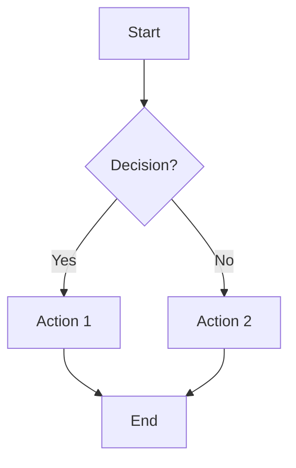

**Directions:** `TB`/`TD` (top-down), `BT`, `LR`, `RL`

**Node shapes:** `A[rect]` `A(rounded)` `A([stadium])` `A[[subroutine]]` `A[(cylinder)]` `A((circle))` `A{diamond}` `A{{hexagon}}` `A[/parallelogram/]` `A[/trapezoid\]` `A(((double circle)))`

**Links:** `-->` arrow, `---` open, `-.->` dotted, `==>` thick, `~~~` invisible, `<-->` bidirectional. Add text: `-->|text|` or `-- text -->`

**Subgraphs:** `subgraph id[title] ... end`

**Multi-line labels:** `\n` does NOT work. Use markdown strings with backticks and real newlines:
```mermaid
A["`Line 1
Line 2
Line 3`"]
```
Markdown strings also support **bold** and *italic* formatting.

**Styling:** `style A fill:#f9f,stroke:#333` or `classDef cls fill:#f9f; A:::cls`

### 2. Sequence Diagram

**Use for:** API calls, service interactions, request/response flows, protocol sequences.

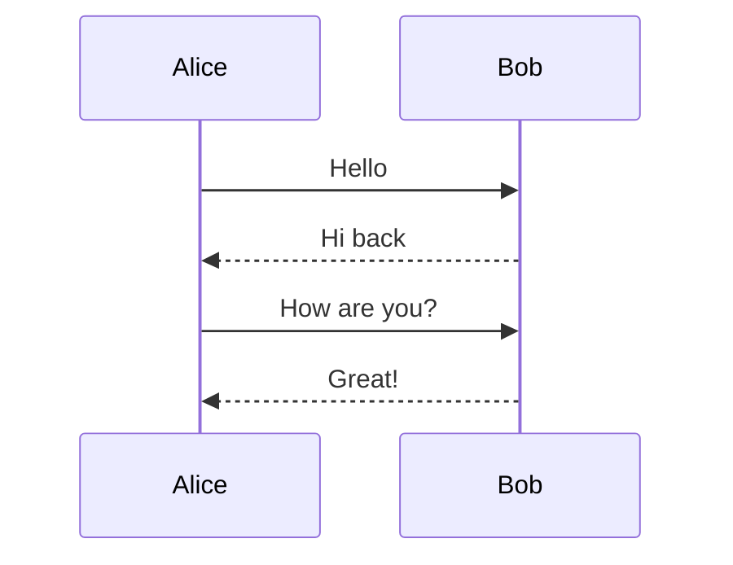

**Participants:** `participant`, `actor`. Stereotypes (JSON config): `boundary`, `control`, `entity`, `database`, `collections`, `queue`

**Arrows:** `->>` solid+arrowhead, `-->>` dotted+arrowhead, `-x` cross end, `-)` async open arrow, `<<->>` bidirectional

**Activations:** `activate A` / `deactivate A` or shorthand `A->>+B: msg` / `B-->>-A: reply`

**Notes:** `Note right of A: text` or `Note over A,B: text`

**Control flow:**
- `loop text ... end`
- `alt text ... else ... end`
- `opt text ... end`
- `par [Action 1] ... and [Action 2] ... end`
- `critical [text] ... option [text] ... end`
- `break [text] ... end`

**Grouping:** `box color Title ... end`

**Background highlight:** `rect rgb(0,255,0) ... end`

### 3. Class Diagram

**Use for:** OOP class structures, inheritance hierarchies, domain models.

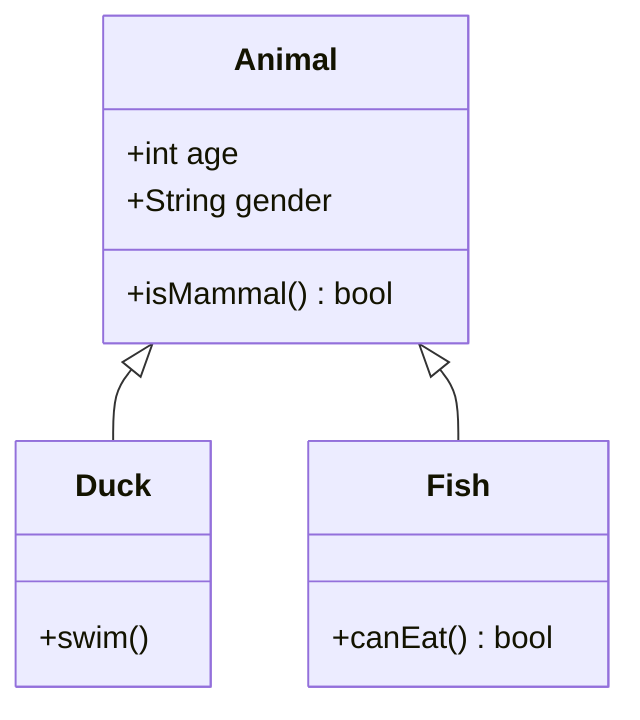

**Members:** Bracket syntax `Class { +method() returnType; -field type }`. Visibility: `+` public, `-` private, `#` protected, `~` internal. Classifiers: `*` abstract, `$` static.

**Relationships:** `<|--` inheritance, `*--` composition, `o--` aggregation, `-->` association, `..>` dependency, `..|>` realization

**Cardinality:** `ClassA "1" --> "*" ClassB`

**Annotations:** `<<Interface>>`, `<<Abstract>>`, `<<Enumeration>>`, `<<Service>>`

**Generics:** `List~int~`

**Namespaces:** `namespace Name { class A { } }`

**Notes:** `note "text"` or `note for ClassName "text"`

### 4. State Diagram

**Use for:** Finite state machines, lifecycle states, object state transitions.

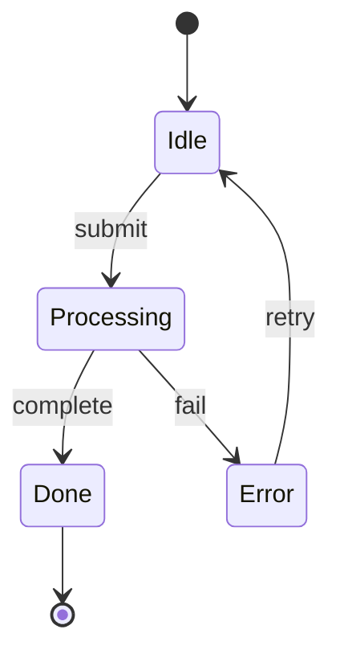

**States:** `stateName`, `stateName : Description`, `state "Description" as s1`

**Start/End:** `[*] --> First`, `Last --> [*]`

**Composite:** `state CompositeState { InnerA --> InnerB }`

**Choice:** `state decision <<choice>>`

**Fork/Join:** `state fork <<fork>>`, `state join <<join>>`

**Notes:** `note right of State : text ... end note`

**Concurrency:** `state Parallel { A --> B -- C --> D }` (use `--` separator)

**Direction:** `direction LR` (or `RL`, `TB`, `BT`)

### 5. Entity Relationship Diagram

**Use for:** Database schemas, data models, table relationships.

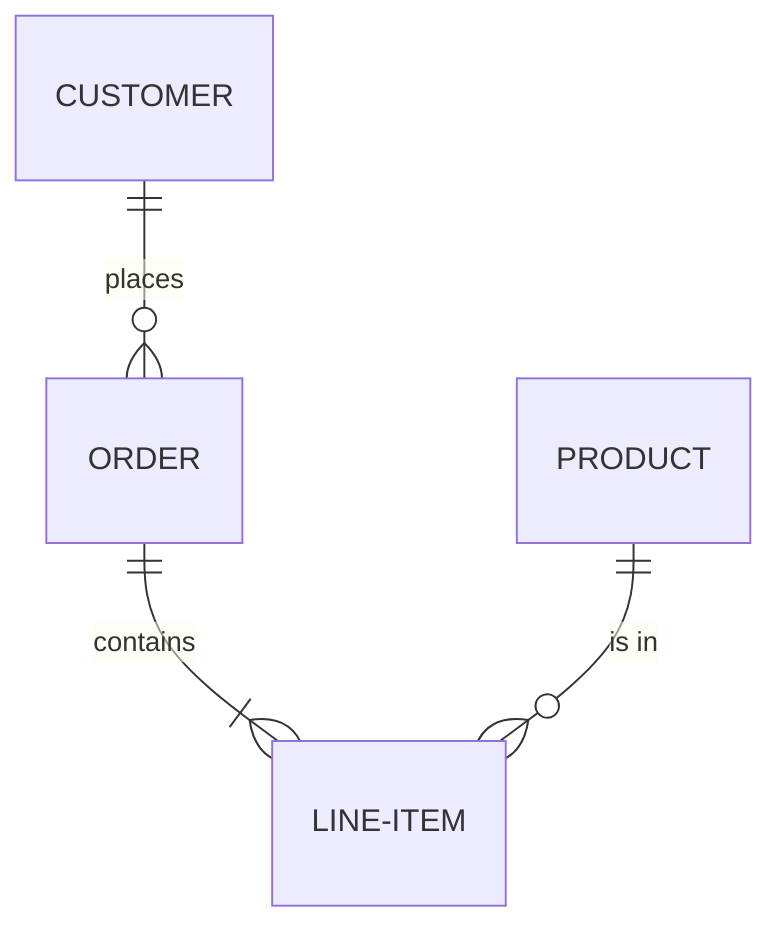

**Cardinality:** `||` exactly one, `o|` zero or one, `}|` one or more, `o{` zero or more

**Line style:** `--` identifying (solid), `..` non-identifying (dashed)

**Attributes:**
```
ENTITY {
    string name PK
    int age
    string email UK "user email"
}
```
Key types: `PK`, `FK`, `UK`

### 6. Gantt Chart

**Use for:** Project schedules, task timelines, sprint planning.

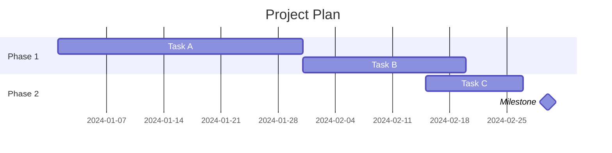

**Task format:** `Task name :tags, id, start, end/duration`. Tags: `done`, `active`, `crit`, `milestone`

**Dependencies:** `after taskId`, `until taskId`

**Date config:** `dateFormat YYYY-MM-DD`, `axisFormat %Y-%m-%d`

**Excludes:** `excludes weekends` or specific dates

### 7. Pie Chart

**Use for:** Proportions, distributions, market share.

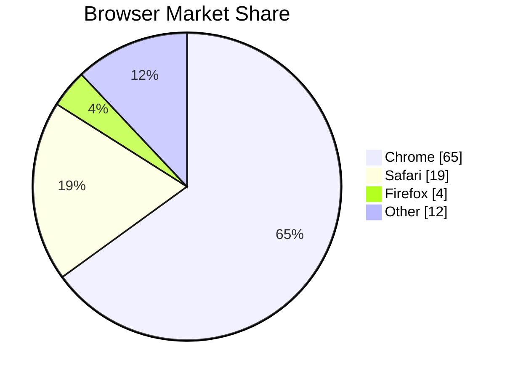

**Syntax:** `pie [showData] [title text]` then `"label" : value` per line. Values must be positive numbers.

### 8. Git Graph

**Use for:** Branch strategies, release flows, git workflows.

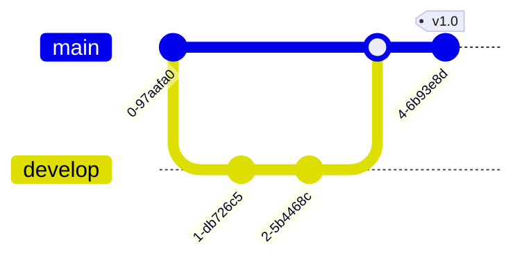

**Commands:** `commit`, `branch name`, `checkout name`, `merge name`, `cherry-pick id:"commitId"`

**Commit options:** `id: "abc"`, `tag: "v1.0"`, `type: NORMAL|REVERSE|HIGHLIGHT`

### 9. Mindmap

**Use for:** Brainstorming, topic hierarchies, concept maps.

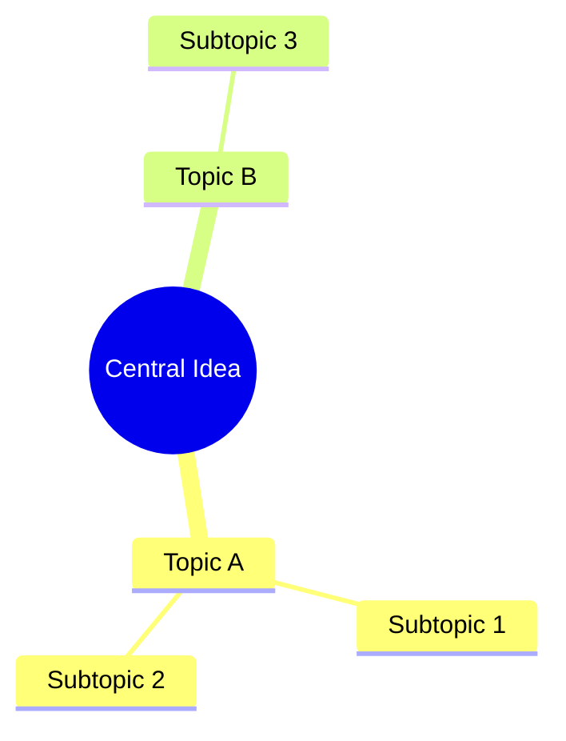

**Hierarchy:** Indentation defines parent-child relationships.

**Shapes:** `[square]`, `(rounded)`, `((circle))`, `)cloud(`, `{{hexagon}}`, `))bang((` or plain text.

**Icons:** `::icon(fa fa-book)` after node text.

**Classes:** `:::className` after node text.

### 10. Timeline

**Use for:** Historical events, release histories, roadmaps.

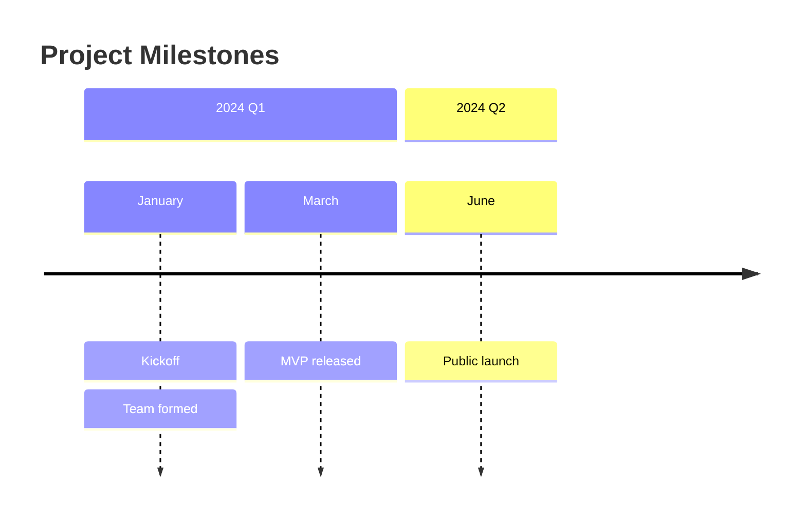

**Syntax:** `time period : event1 : event2` or stack events on separate lines with `: event`.

**Sections:** `section Title` groups subsequent entries.

### 11. User Journey

**Use for:** UX flows, customer experience mapping, satisfaction scoring.

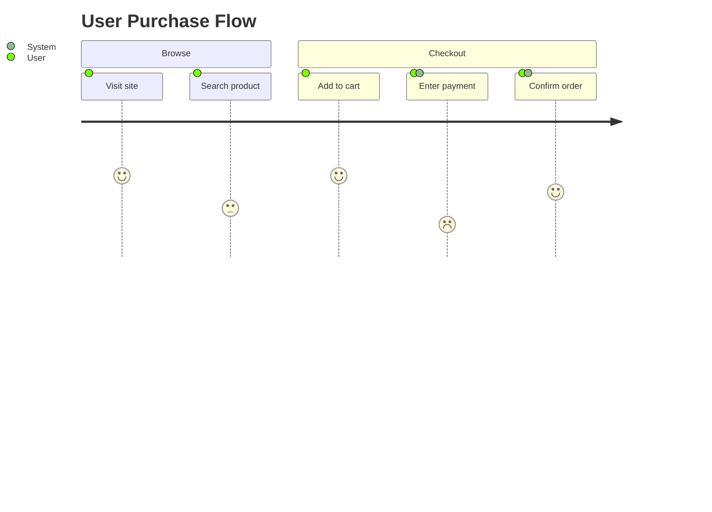

**Syntax:** `Task name: score: actor1, actor2`. Score is 1-5 (1=bad, 5=great).

**Sections:** Group tasks into phases.

### 12. Quadrant Chart

**Use for:** Priority matrices, competitive analysis, effort-vs-impact plots.

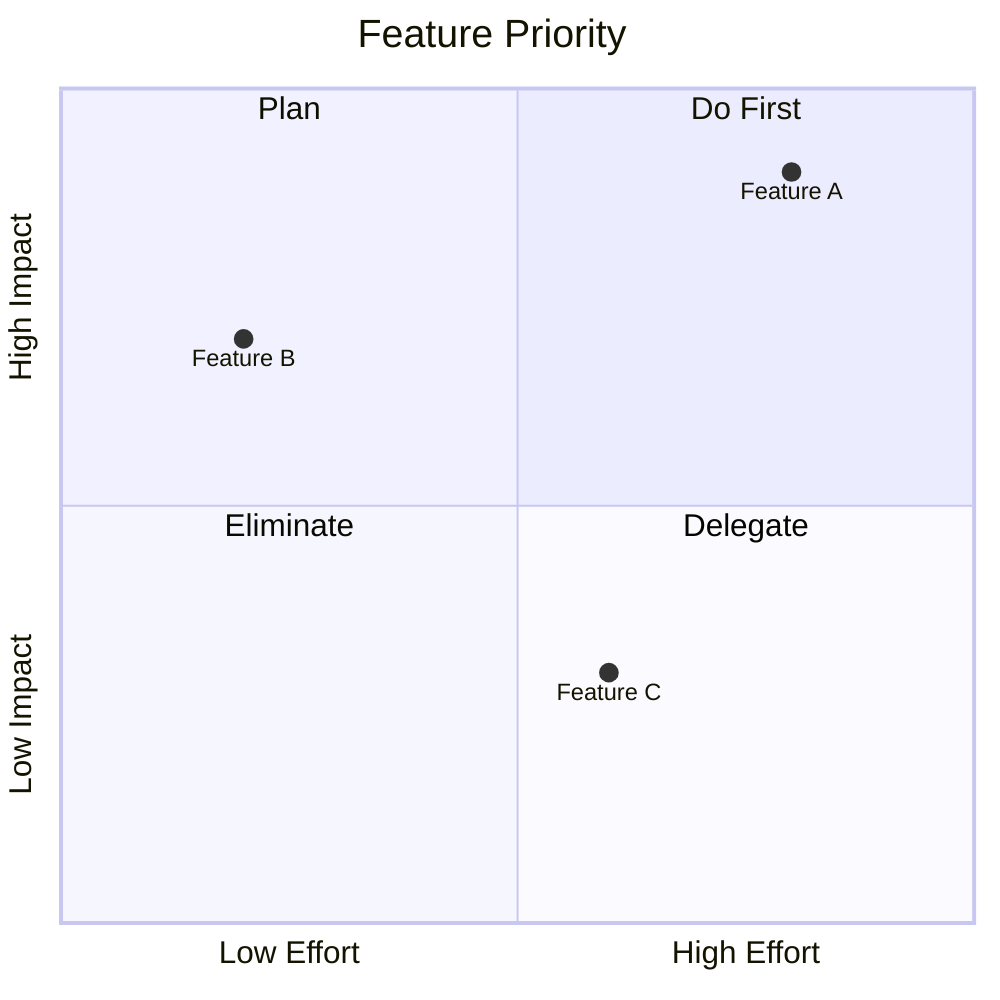

**Points:** `Label: [x, y]` where x,y are 0-1. Optional: `radius: 12`, `color: #ff3300`

### 13. Sankey Diagram

**Use for:** Flow quantities, energy/resource distribution, budget allocation.

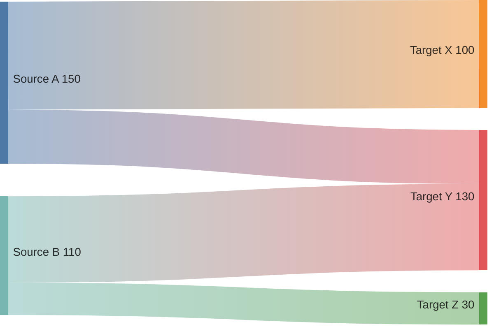

**Syntax:** CSV format `source,target,value`. Wrap commas in quotes: `"A, Inc",B,100`

**Config:** `linkColor: source|target|gradient|#hex`, `nodeAlignment: justify|center|left|right`

### 14. XY Chart (Bar/Line)

**Use for:** Data trends, comparisons, statistics.

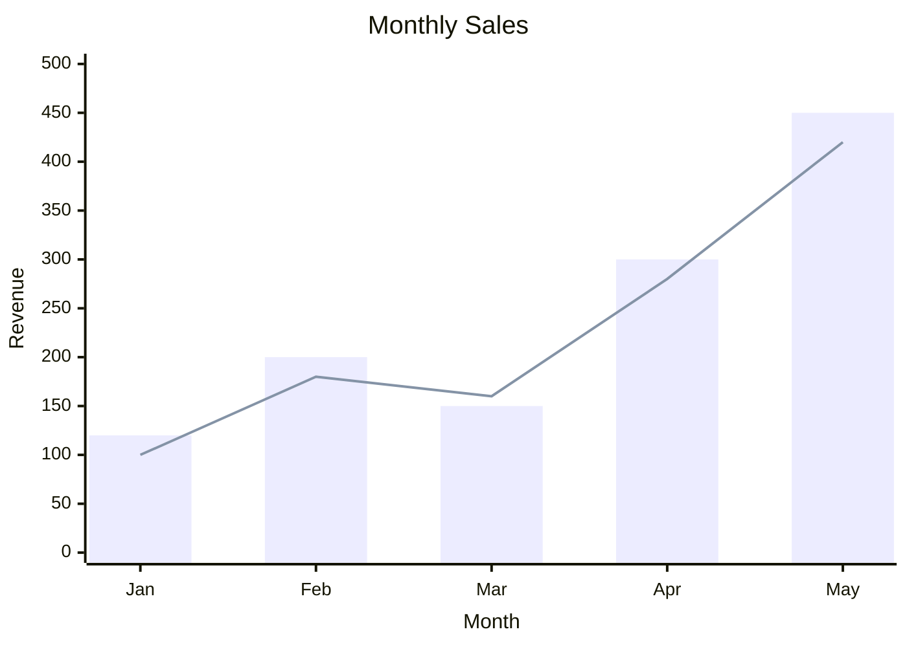

**Orientation:** `xychart horizontal` for horizontal layout.

**X-axis:** categorical `["a", "b"]` or numeric `min --> max`. **Y-axis:** numeric only.

**Data:** `bar [values]` and/or `line [values]`.

### 15. Block Diagram

**Use for:** System architecture layouts, infrastructure diagrams, component arrangements.

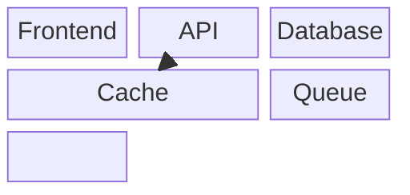

**Columns:** `columns N` sets grid width. Blocks span columns with `:N`.

**Shapes:** Same as flowchart: `[rect]`, `(rounded)`, `((circle))`, `{diamond}`, `[(cylinder)]`, etc.

**Links:** `-->`, `---` with optional text.

**Nesting:** Blocks can contain other blocks for composite layouts.

**Space:** Use `space` or `space:N` to insert empty cells.

### 16. Packet Diagram

**Use for:** Network protocol headers, binary data formats, memory layouts.

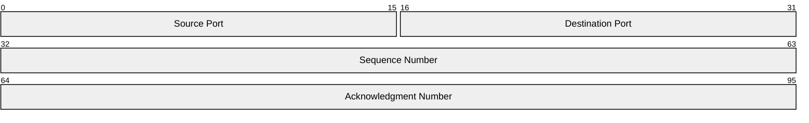

**Syntax:** `start-end: "Field name"` for ranges, or `+N: "Field name"` for N-bit auto-positioned fields.

### 17. Architecture Diagram

**Use for:** Cloud infrastructure, CI/CD pipelines, service topology.

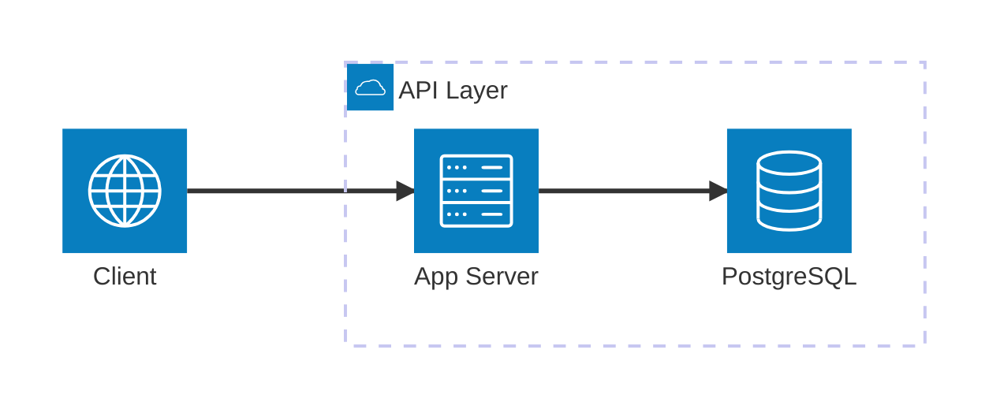

**Groups:** `group id(icon)[Title]` — containers for services. Nest with `in parentId`.

**Services:** `service id(icon)[Title]` — individual nodes. Nest with `in groupId`.

**Edges:** `serviceA:direction --> direction:serviceB`. Directions: `T`, `B`, `L`, `R`.

**Junctions:** `junction id` — four-way connection points.

**Icons:** Built-in: `cloud`, `database`, `disk`, `internet`, `server`. Custom via iconify: `"logos:aws"`

### 18. Kanban Board

**Use for:** Task boards, workflow stages, agile boards.

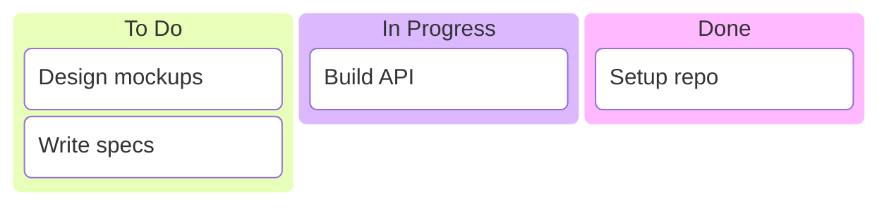

**Columns:** `id[Title]` at root level.

**Tasks:** `id[Description]` indented under a column.

**Metadata:** `@{ assigned: "Alice", ticket: "PROJ-123", priority: "High" }` after task.

**Config:** `ticketBaseUrl` in YAML frontmatter creates clickable ticket links.
