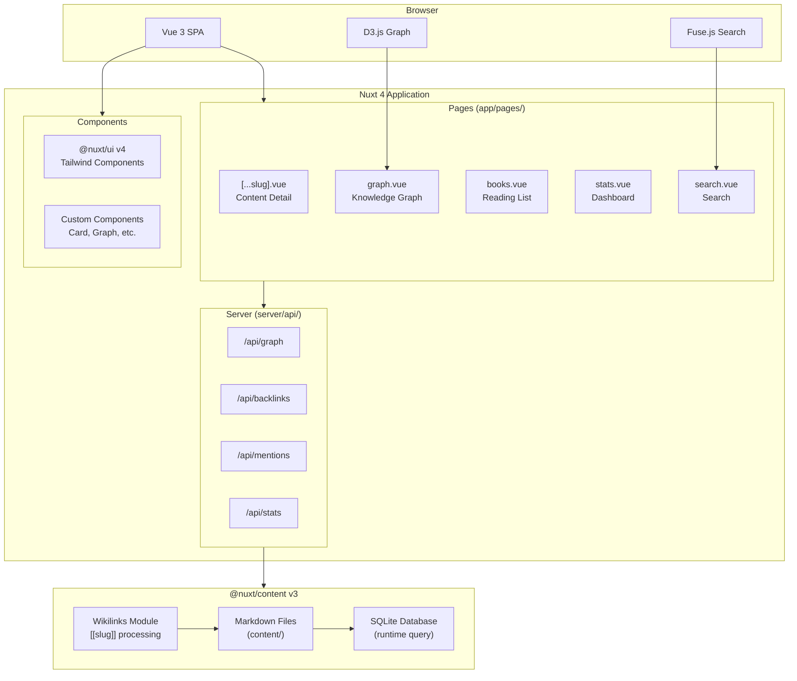

# Project Structure

Second Brain uses a **pnpm workspaces monorepo** structure with two main applications. This page explains the layout and purpose of each directory.

## Monorepo Overview

```text
second-brain/
├── apps/
│   ├── web/         # Main Nuxt application
│   └── docs/        # Documentation site (Docus)
├── docs/            # Internal developer docs
├── scripts/         # Build and automation scripts
├── pnpm-workspace.yaml
└── package.json     # Root workspace scripts
```

### Workspace Commands

Run these from the repository root:

| Command | Description |
|---------|-------------|
| `pnpm dev` | Start web app at localhost:3000 |
| `pnpm dev:docs` | Start docs site at localhost:3001 |
| `pnpm build` | Build web app for production |
| `pnpm lint:fix` | Auto-fix linting issues |
| `pnpm typecheck` | Verify type safety |
| `pnpm test:unit` | Run unit tests |

## Web Application (`apps/web/`)

The main Nuxt 4 application that powers your knowledge base.

```text
apps/web/
├── app/                    # Vue application code
│   ├── app.vue             # Root Vue component
│   ├── pages/              # File-based routing
│   ├── components/         # Reusable UI components
│   ├── composables/        # Vue composition functions
│   ├── layouts/            # Page layouts
│   ├── assets/             # Styles, fonts
│   ├── constants/          # Static configuration
│   ├── types/              # TypeScript definitions
│   └── utils/              # Utility functions
├── content/                # Markdown files (your notes)
├── server/                 # Server-side code
│   ├── api/                # API endpoints
│   ├── plugins/            # Server plugins
│   └── utils/              # Server utilities
├── modules/                # Custom Nuxt modules
├── public/                 # Static assets
├── tests/                  # Test files
├── site.config.ts          # Site customization
├── content.config.ts       # Content schema definitions
└── nuxt.config.ts          # Nuxt configuration
```

## Architecture Diagram



## Key Directories Explained

### `app/pages/`

File-based routing following Nuxt conventions:

| File | Route | Purpose |
|------|-------|---------|
| `[...slug].vue` | `/*` | Catch-all for content pages |
| `books.vue` | `/books` | Reading list with status tracking |
| `graph.vue` | `/graph` | Interactive knowledge graph |
| `search.vue` | `/search` | Search results page |
| `stats.vue` | `/stats` | Statistics dashboard |
| `table.vue` | `/table` | Table view for all content |

### `app/components/`

Reusable Vue components organized by feature:

- **Graph/** - D3.js visualization components
- **Content/** - Content rendering components
- **Navigation/** - Header, sidebar, footer
- **Cards/** - Content preview cards

### `app/composables/`

Vue composition functions for shared logic:

| Composable | Purpose |
|------------|---------|
| `useSiteConfig()` | Access site configuration |
| `usePageTitle()` | Set page titles consistently |
| `useContentHelpers()` | Content query utilities |
| `useSearch()` | Search functionality |

### `content/`

Your knowledge base content. Uses a **flat structure** with no nested folders for notes.

```text
content/
├── atomic-habits.md          # Book note
├── vue-reactivity.md         # Technical note
├── productivity.md           # Evergreen note
├── authors/                  # Author profiles
│   └── james-clear.md
├── podcasts/                 # Podcast show definitions
│   └── lex-fridman-podcast.md
└── _obsidian-templates/      # Note templates
```

::alert{type="info"}
The flat structure is intentional. Organization emerges from **wiki-links** and **tags**, not folders. This follows the Zettelkasten methodology.
::

### `server/api/`

Server endpoints that power the application:

| Endpoint | Purpose |
|----------|---------|
| `/api/graph` | Returns all nodes and edges for visualization |
| `/api/backlinks` | Index of what links to what |
| `/api/mentions` | Title and text mentions across content |
| `/api/stats` | Aggregated statistics (cached 10min) |
| `/api/note-graph/[slug]` | Mini-graph for a specific note |
| `/api/raw-content/[slug]` | Raw markdown content |

### `modules/`

Custom Nuxt modules:

| Module | Purpose |
|--------|---------|
| `wikilinks.ts` | Remark plugin that processes `[[slug]]` syntax into links |

## Configuration Files

### `site.config.ts`

Central configuration for site branding and features:

```typescript
export default {
  name: 'Second Brain',
  description: 'Personal knowledge base',
  navigation: [...],    // Sidebar menu items
  shortcuts: [...],     // Keyboard shortcuts
  socials: {...}        // Social links
}
```

### `content.config.ts`

Schema definitions for content types using Zod:

```typescript
// Defines fields for each content type
// - Required vs optional fields
// - Validation rules (e.g., authors required for external content)
// - Type-specific fields (readingStatus for books, etc.)
```

### `nuxt.config.ts`

Nuxt framework configuration:

- Module registrations
- Content database settings
- Build configuration
- PWA settings

## Flat Content Philosophy

Unlike traditional folder-based organization, Second Brain uses a flat structure where:

1. **All notes live in `content/`** (not nested subfolders)
2. **Type is determined by frontmatter** (`type: book`, `type: podcast`, etc.)
3. **Connections are made via wiki-links** (`[[other-note]]`)
4. **Organization emerges from links**, not hierarchy

This approach:
- Reduces friction when creating notes
- Encourages connections over categorization
- Follows the Zettelkasten methodology
- Makes refactoring trivial (no folder moves needed)

## Next Steps

::card-group
  ::card
  ---
  title: Content Types
  icon: i-heroicons-document-text
  to: /content/content-types
  ---
  Learn about the different content types and their fields.
  ::
  ::card
  ---
  title: Wiki-Links
  icon: i-heroicons-link
  to: /content/wiki-links
  ---
  Understand how to connect your notes.
  ::
::
