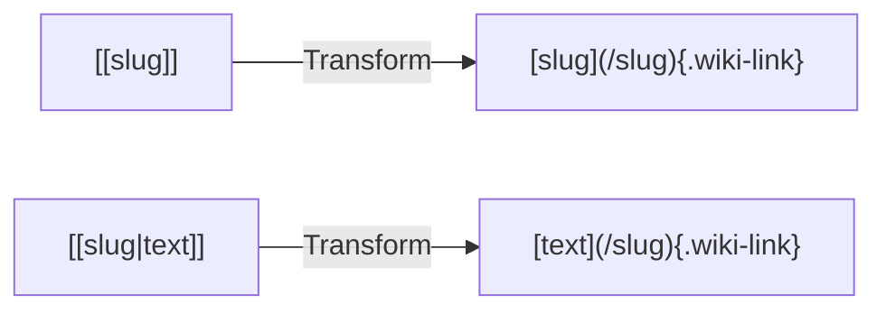

# Wiki-Links and Connections

Wiki-links are the foundation of Second Brain's Zettelkasten-style knowledge management. They create bidirectional connections between notes, enabling you to discover relationships and build a interconnected knowledge graph.

## Wiki-Link Syntax

### Basic Links

Use double brackets to link to any content by its slug:

```markdown
Check out [[atomic-habits]] for habit-building strategies.
```

This creates a clickable link to the "Atomic Habits" note. The slug is the filename without the `.md` extension, normalized to lowercase with hyphens.

### Custom Display Text

Use the pipe character to customize the displayed text:

```markdown
James Clear's [[atomic-habits|book on habits]] changed my perspective.
```

This renders as "book on habits" but links to the `atomic-habits` note.

### Slug Normalization

Wiki-links are automatically normalized:

| You Write | Becomes |
|-----------|---------|
| `[[Atomic Habits]]` | `/atomic-habits` |
| `[[AI Agents Guide]]` | `/ai-agents-guide` |
| `[[My Note Title]]` | `/my-note-title` |

Spaces become hyphens, and everything is converted to lowercase.

## How Wiki-Links Work

The wiki-link system is implemented as a custom Nuxt module that transforms markdown before parsing:



The transformation happens in `modules/wikilinks.ts` during the `content:file:beforeParse` hook. Wiki-links receive a `.wiki-link` CSS class for styling.

## Backlinks vs Mentions

Second Brain tracks two types of incoming connections:

### Backlinks (Linked References)

**Backlinks** are explicit wiki-link connections. When Note A contains `[[note-b]]`, Note B's backlinks will show Note A.

- Created via `[[slug]]` syntax
- Shown in the "Linked References" section
- Counted for connection metrics in the graph

### Mentions (Unlinked References)

**Mentions** are implicit text matches. When Note A contains the phrase "Atomic Habits" (without wiki-link syntax), it appears as a mention on the Atomic Habits note.

- Found by searching for title matches in content
- Shown in the "Mentions" section with context snippets
- Highlights the matching text
- Helps discover connection opportunities

::alert{type="info"}
Mentions only appear for titles with 3+ characters to avoid false positives.
::

## Connection Visualization

### On Content Pages

Each content page displays:

1. **Connections Graph** - A radial visualization showing directly connected notes
2. **Linked References** - List of notes that link TO this note
3. **Mentions** - Text mentions that could become wiki-links

### On the Knowledge Graph

The full knowledge graph (`/graph`) shows all connections:

- Nodes = individual content items
- Edges = wiki-link connections
- Node size = number of connections
- Orphan nodes = content with no connections

## Maps of Content (MOCs)

Maps of Content are special notes with `type: map` that serve as curated entry points to a topic.

### Creating a MOC

```yaml
---
title: "AI Agents Guide"
type: map
tags:
  - ai-agents
  - llm
summary: "Patterns and practices for building AI agents"
---

This map connects resources on building effective AI agents.

## Design Patterns

- [[agentic-design-patterns]] - Architectural patterns for agents
- [[building-effective-agents]] - Anthropic's principles

## Implementation

- [[building-an-ai-agent-with-typescript]] - TypeScript guide
```

### MOC Visualization

MOCs have special handling in the knowledge graph:

- **`isMap` flag** - Nodes with `type: map` are marked
- **Map membership** - Notes linked from a MOC get the MOC added to their `maps[]` array
- **Filtering** - The graph can filter to show only notes belonging to specific MOCs

This allows you to visualize clusters of related content organized by your MOCs.

## Best Practices

### Link Liberally

Create wiki-links whenever you reference related content. The more connections, the more valuable your knowledge graph becomes.

```markdown
<!-- Good: Multiple relevant connections -->
Building [[atomic-habits]] requires [[deep-work]] and understanding
your [[leadership-principles]].
```

### Use Meaningful Slugs

Choose descriptive slugs that will be easy to reference:

```markdown
<!-- Good: Clear, descriptive slugs -->
[[building-effective-agents]]
[[vue3-development-guide]]

<!-- Avoid: Generic or unclear slugs -->
[[notes-1]]
[[stuff]]
```

### Create MOCs for Topics

When you accumulate several notes on a topic, create a MOC to organize them:

1. Create a new note with `type: map`
2. Write a brief introduction
3. Organize links by subtopic or theme
4. Add to relevant notes as `[[your-moc]]`

### Check Mentions Regularly

Review the "Mentions" section on your notes to discover unlinked references. Convert relevant mentions to explicit wiki-links to strengthen connections.

### Balance Connections

Aim for notes that are neither:
- **Orphans** (0 connections) - disconnected from your knowledge
- **Hubs** (too many connections) - consider breaking into focused MOCs

The stats dashboard shows your orphan percentage and hub notes to help maintain balance.

## Related

- [[2.content-types]] - Content type reference
- [[4.collections]] - Author and podcast collections
