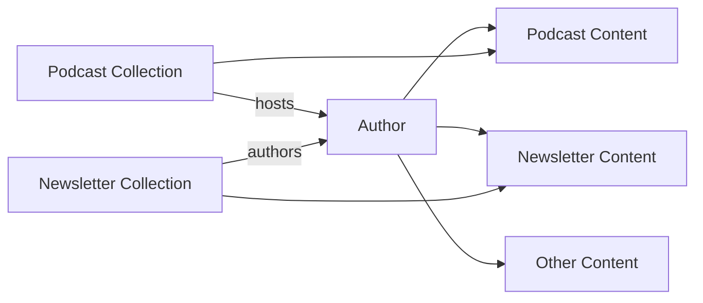

# Authors and Collections

Second Brain uses three specialized collections for managing creators and content sources: **authors**, **podcasts**, and **newsletters**. These collections establish relationships between content and their creators.

## Authors Collection

Authors represent people or organizations that create content. Every piece of external content (articles, books, videos, etc.) requires at least one author reference.

### Author Schema

| Field | Type | Required | Description |
|-------|------|----------|-------------|
| `name` | string | Yes | Display name of the author |
| `slug` | string | Yes | URL-safe identifier (must match filename) |
| `bio` | string | No | Short biography or description |
| `avatar` | string | No | URL to profile image |
| `website` | string | No | Personal website URL |
| `socials` | object | No | Social media handles |

#### Socials Object

The `socials` field supports these platforms:

- `twitter` - Twitter/X username (without @)
- `github` - GitHub username
- `linkedin` - LinkedIn profile slug
- `youtube` - YouTube channel handle

### Author Example

```yaml [content/authors/michael-thiessen.md]
---
name: "Michael Thiessen"
slug: "michael-thiessen"
bio: "Full-time Vue educator, author of Vue Tips Collection, Reusable Components, and Clean Components. Weekly newsletter to 12k+ Vue developers."
avatar: "https://github.com/tesla3327.png"
website: "https://michaelnthiessen.com"
socials:
  twitter: "MichaelThiessen"
  github: "tesla3327"
  linkedin: "michaelnthiessen"
---
```

### Referencing Authors in Content

External content types reference authors by their slug:

```yaml [content/vue-tips-collection.md]
---
title: "Vue Tips Collection"
type: book
authors:
  - michael-thiessen
tags:
  - vue
---
```

::alert{type="info"}
Author slugs must match the filename. The file `authors/michael-thiessen.md` creates the slug `michael-thiessen`.
::

## Podcasts Collection

Podcasts represent show metadata. Individual episodes are stored as `podcast` type content items that reference the podcast collection.

### Podcast Schema

| Field | Type | Required | Description |
|-------|------|----------|-------------|
| `name` | string | Yes | Podcast show name |
| `slug` | string | Yes | URL-safe identifier (must match filename) |
| `description` | string | No | Show description |
| `artwork` | URL | No | Podcast cover art image |
| `website` | URL | No | Official podcast website |
| `hosts` | string[] | Yes | Array of author slugs for hosts (min 1) |
| `feed` | URL | No | RSS feed URL |
| `platforms` | object | No | Platform-specific URLs |

#### Platforms Object

The `platforms` field is a flexible key-value map. Common platforms include:

- `spotify` - Spotify show URL
- `apple` - Apple Podcasts URL
- `youtube` - YouTube channel URL
- `overcast` - Overcast URL
- `pocketcasts` - Pocket Casts URL

### Podcast Example

```yaml [content/podcasts/lex-fridman-podcast.md]
---
name: "Lex Fridman Podcast"
slug: "lex-fridman-podcast"
description: "Conversations about the nature of intelligence, consciousness, love, and power"
artwork: "https://i.scdn.co/image/ab6765630000ba8a87162c4a7f98f1e2f5e4fe8f"
website: "https://lexfridman.com/podcast"
hosts:
  - lex-fridman
platforms:
  spotify: "https://open.spotify.com/show/2MAi0BvDc6GTFvKFPXnkCL"
  apple: "https://podcasts.apple.com/us/podcast/lex-fridman-podcast/id1434243584"
  youtube: "https://www.youtube.com/@lexfridman"
---
```

### Creating Podcast Episodes

Podcast episodes use the `podcast` content type with a reference to the podcast collection:

```yaml [content/andrej-karpathy-llm-os.md]
---
title: "Andrej Karpathy: LLM OS, From Software 1.0 to 2.0"
type: podcast
podcast: lex-fridman-podcast
authors:
  - lex-fridman
guests:
  - andrej-karpathy
url: "https://www.youtube.com/watch?v=..."
tags:
  - ai
  - machine-learning
urls:
  - platform: youtube
    url: "https://www.youtube.com/watch?v=..."
  - platform: spotify
    url: "https://open.spotify.com/episode/..."
---

Episode notes and insights go here...
```

::alert{type="tip"}
The `guests` field allows you to track episode guests separately from the show hosts, making it easy to find all appearances by a specific person.
::

## Newsletters Collection

Newsletters represent publication metadata. Individual newsletter issues are stored as `newsletter` type content items.

### Newsletter Schema

| Field | Type | Required | Description |
|-------|------|----------|-------------|
| `name` | string | Yes | Newsletter name |
| `slug` | string | Yes | URL-safe identifier (must match filename) |
| `description` | string | No | Newsletter description |
| `logo` | URL | No | Newsletter logo image |
| `website` | URL | No | Newsletter homepage |
| `authors` | string[] | Yes | Array of author slugs (min 1) |
| `platform` | enum | No | Publishing platform |
| `topics` | string[] | No | Subject areas covered |

#### Platform Values

Supported newsletter platforms:

- `substack`
- `beehiiv`
- `ghost`
- `convertkit`
- `buttondown`
- `revue`
- `mailchimp`
- `other`

### Newsletter Example

```yaml [content/newsletters/pragmatic-engineer.md]
---
name: "The Pragmatic Engineer"
slug: "pragmatic-engineer"
description: "Big Tech and high-growth startups, from the inside"
logo: "https://substackcdn.com/image/fetch/w_256,..."
website: "https://newsletter.pragmaticengineer.com"
authors:
  - gergely-orosz
platform: substack
topics:
  - software-engineering
  - tech-industry
  - career
---
```

### Creating Newsletter Issues

Newsletter issues use the `newsletter` content type with a reference to the newsletter collection:

```yaml [content/pragmatic-engineer-issue-123.md]
---
title: "The State of AI Coding Tools"
type: newsletter
newsletter: pragmatic-engineer
authors:
  - gergely-orosz
issueNumber: 123
url: "https://newsletter.pragmaticengineer.com/p/..."
tags:
  - ai
  - developer-tools
---

Key insights from this issue...
```

::alert{type="info"}
The `issueNumber` field helps you track specific issues and maintain order in your newsletter content.
::

## Collection Relationships



This diagram shows how authors connect to both collection metadata (as hosts/authors) and individual content items (as creators).

## Querying Collections

Use `queryCollection` to fetch collection data:

```typescript
// Get all authors
const { data: authors } = await useAsyncData(
  'authors',
  () => queryCollection('authors').all()
)

// Get a specific podcast
const { data: podcast } = await useAsyncData(
  'podcast',
  () => queryCollection('podcasts')
    .where('slug', '=', 'lex-fridman-podcast')
    .first()
)

// Get all newsletters on a platform
const { data: substackNewsletters } = await useAsyncData(
  'substack-newsletters',
  () => queryCollection('newsletters')
    .where('platform', '=', 'substack')
    .all()
)
```

## Best Practices

### Author Profiles

1. **Always create authors first** - Before adding content, ensure the author exists in `content/authors/`
2. **Use GitHub avatars** - For developers, `https://github.com/username.png` provides reliable avatars
3. **Keep bios concise** - One or two sentences summarizing who they are and what they do

### Podcast Shows

1. **Include multiple platforms** - Listeners use different apps, so provide links where available
2. **Host authors must exist** - Create author profiles for all podcast hosts
3. **Use high-quality artwork** - Square images (ideally 1400x1400) work best

### Newsletters

1. **Specify the platform** - This helps with styling and link behavior
2. **Track issue numbers** - Makes it easy to find specific issues later
3. **Include topics** - Helps categorize and filter newsletters by subject area
