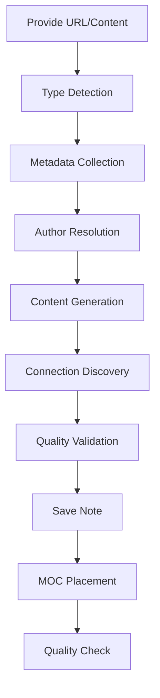
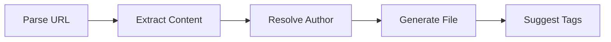
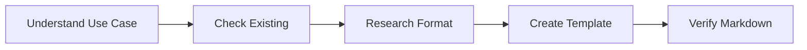
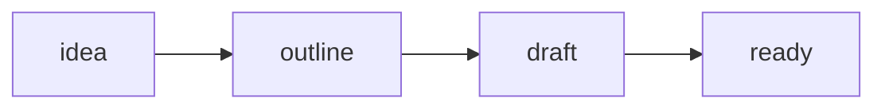

# Adding Content

Claude Code skills streamline content creation in Second Brain. These four skills handle the most common workflows for capturing new information.

## Available Skills

| Skill | Trigger Phrases | Purpose |
|-------|-----------------|---------|
| `/adding-notes` | "add a note", "create a note", "save this" | Add any content type with full metadata |
| `/adding-tweets` | "add this tweet", "save this tweet" | Capture tweets with author linking |
| `/creating-obsidian-templates` | "create a template", "make a template for" | Build Obsidian templates |
| `/managing-blog-ideas` | "create a blog idea", "start a blog post" | Develop blog posts from idea to draft |

---

## /adding-notes

The primary skill for adding content to Second Brain. It automatically detects content type from URLs and guides you through a structured workflow.

### Content Type Detection

The skill routes content based on URL patterns:

| URL Pattern | Content Type |
|-------------|--------------|
| youtube.com | YouTube video, talk, or podcast (auto-classified) |
| reddit.com | Reddit thread |
| github.com | GitHub repository |
| goodreads.com, amazon.com (books) | Book |
| spotify.com/episode, podcasts.apple.com | Podcast episode |
| *.substack.com/p/*, beehiiv.com | Newsletter issue |
| udemy.com, coursera.org | Course |
| imdb.com, themoviedb.org | Movie |
| Other URLs | Article |
| No URL provided | Note |

### Workflow Phases



**Phase 1: Type Detection**
- Analyzes URL pattern to determine content type
- Loads type-specific handling instructions

**Phase 2: Metadata Collection**
- Runs scripts to fetch title, author, description
- For YouTube: fetches transcript if available
- For GitHub: fetches stars, language, description

**Phase 3: Author Resolution**
- Checks if author already exists in `content/authors/`
- Creates new author profile if needed
- Uses web search to populate bio, avatar, socials

**Phase 4: Content Generation**
- Compiles frontmatter from collected metadata
- Generates summary framed as core argument
- Applies writing-style guidelines

**Phase 5: Connection Discovery**
- Searches for related notes by same author
- Finds notes with overlapping tags
- Only adds genuine, meaningful connections

**Phase 6: Quality Validation**
- Verifies all wiki-links resolve to existing notes
- Checks for duplicate content
- Validates type-specific fields

**Phase 7: Save Note**
- Generates slug from title
- Saves to `content/{slug}.md`
- Reports link density status

**Phase 8: MOC Placement**
- Suggests relevant Maps of Content for the new note
- Checks if any tags have enough notes to warrant a new MOC

### Example Conversation

```
User: Add this to my notes https://youtube.com/watch?v=abc123

Claude: I'll add this YouTube video to your Second Brain.

[Fetches metadata: "Building a Second Brain with Tiago Forte"]
[Detects: Conference talk based on channel]
[Checks author: Tiago Forte exists ✓]
[Finds connections: 3 notes by same author]

Here's what I've prepared:

---
type: talk
title: "Building a Second Brain with Tiago Forte"
authors: [tiago-forte]
tags: [pkm, note-taking, productivity]
summary: "Knowledge work demands a system for capturing..."
---

## Key Ideas

The presentation argues that...

## Connections

- [[building-a-second-brain]] - The book this talk summarizes
- [[progressive-summarization]] - Core technique discussed

✓ Note saved: content/building-a-second-brain-talk.md
  - Type: talk
  - Wiki-links: 2 connections (connected)
```

---

## /adding-tweets

Captures tweets with proper author linking and metadata.

### Expected Input

Provide both the tweet URL and the pasted content:

```
Add this tweet https://x.com/naval/status/1234567890

my favorite way to use Claude Code is spec based

start with a minimal spec and ask Claude to interview you
```

### Workflow



**Phase 1: Parse URL**
- Extracts tweet ID and author handle from URL
- Supports both x.com and twitter.com domains

**Phase 2: Extract Content**
- Parses tweet text from pasted content
- Extracts date if visible
- Uses handle as author name if display name not provided

**Phase 3: Resolve Author**
- Checks for existing author profile
- Creates minimal profile if needed (name + Twitter link)
- Suggests `/enhancing-authors` for full profile later

**Phase 4: Generate File**
- Creates file in `content/tweets/`
- Uses slug format: `tweet-{tweetId}`
- Populates all frontmatter fields

**Phase 5: Suggest Improvements**
- Recommends relevant tags based on content
- Prompts for personal annotations
- Suggests wiki-links to related notes

### Tweet File Structure

```yaml
---
type: tweet
title: "First 50 characters of tweet..."
tweetId: "1234567890"
tweetUrl: "https://x.com/naval/status/1234567890"
tweetText: "Full tweet content here"
author: naval
tweetedAt: 2024-01-15
tags:
  - claude-code
  - ai-agents
---

Personal annotations go here - why this tweet matters to you.
```

### Example Conversation

```
User: Add this tweet https://x.com/swyx/status/9876543210

AI Engineering is the new Software Engineering.
Not replacing it. Extending it.

Claude: I'll add this tweet to your Second Brain.

[Parsed: @swyx, tweet ID 9876543210]
[Author exists: ✓ swyx.md]

✓ Tweet saved: content/tweets/tweet-9876543210.md

Suggested tags based on content:
- ai-agents
- ai-engineering
- software-engineering

Would you like to add any personal annotations about why
this resonates with you?
```

---

## /creating-obsidian-templates

Creates templates for the Obsidian vault that work with the core Templates plugin.

### Template Location

All templates are stored in `content/_obsidian-templates/` (excluded from Nuxt Content).

### Template Syntax

Obsidian templates use these placeholders:

| Placeholder | Output |
|-------------|--------|
| `{{date}}` | Current date (YYYY-MM-DD) |
| `{{date:format}}` | Custom date format |
| `{{time}}` | Current time |
| `{{title}}` | Note title |

### Workflow



1. **Understand the use case** - Ask what the template is for if unclear
2. **Check existing templates** - Avoid duplicates
3. **Research structure** - Fetch examples from web if needed
4. **Create template** - Write to `content/_obsidian-templates/{name}.md`
5. **Verify** - Confirm valid markdown

### Example Conversation

```
User: Create a template for weekly reviews

Claude: I'll create a weekly review template for your Obsidian vault.

[Checking existing templates...]
[No weekly review template exists]

Here's the template I've created:

---
title: "Weekly Review - {{date:YYYY-MM-DD}}"
draft: true
---

## Wins This Week
-

## Challenges
-

## Lessons Learned
-

## Next Week Focus
-

✓ Template saved: content/_obsidian-templates/weekly-review.md

To use this template in Obsidian:
1. Settings → Core plugins → Enable Templates
2. Set template folder to: _obsidian-templates
3. Use Cmd/Ctrl + T to insert
```

---

## /managing-blog-ideas

Develops blog posts from initial concept to publication-ready draft.

### Blog Idea Location

All blog ideas live in `content/blog-ideas/` (excluded from publishing).

### Modes

| Mode | Trigger | Action |
|------|---------|--------|
| List | "list blog ideas" | Show all ideas with status |
| Create | New topic | Generate fresh blog idea |
| Update | Existing slug | Load and evolve the idea |

### Status Progression



| Status | Criteria | Next Step |
|--------|----------|-----------|
| `idea` | Has title and core thesis | Develop outline |
| `outline` | 3+ sections with bullets | Draft sections |
| `draft` | At least one section has prose | Complete all sections |
| `ready` | All sections drafted and reviewed | Publish |

### Create Mode Workflow

1. **Gather Information**
   - Get topic from user
   - Search Second Brain for related notes
   - Present found connections

2. **Generate Blog Idea**
   - Create working title
   - Write single-sentence thesis
   - Generate 3-5 section outline
   - Link to source notes

3. **User Review**
   - Present generated content
   - Allow edits before saving

4. **Save**
   - Generate slug from title
   - Save to `content/blog-ideas/`

### Update Mode Actions

When updating an existing blog idea:

- **Expand outline** - Add sections or detail
- **Draft a section** - Write prose for one section
- **Find sources** - Search Second Brain for more related notes
- **Update status** - Move to next stage
- **Refine core idea** - Sharpen the thesis

### Blog Idea Structure

```yaml
---
title: "How to Build a Knowledge Graph with D3.js"
status: outline
tags:
  - d3
  - visualization
core_idea: "Force-directed graphs reveal hidden connections..."
target_audience: "Vue/Nuxt developers building PKM tools"
created: 2024-01-15
updated: 2024-01-20
---

## Core Idea

Force-directed graphs transform your notes into a visual
map of knowledge connections.

## Outline

### 1. The Problem with Linear Note Lists
- Notes get buried
- Connections invisible

### 2. Why Graph Visualization Works
- Visual pattern recognition
- Emergent clusters

### 3. Implementation with D3.js
- Force simulation basics
- Node sizing by connections

## Source Notes

- [[knowledge-graph]] - Implementation details
- [[d3-force-simulation]] - API reference

## Open Questions

- How to handle 1000+ nodes performantly?
```

### Example Conversation

```
User: Start a blog post about using Claude Code with specs

Claude: I'll create a blog idea about spec-driven Claude Code usage.

[Searching Second Brain for related notes...]
[Found: 5 notes about Claude Code, 3 about PRDs]

Here's the blog idea:

---
title: "Write Less Prompt, Get Better Code: Spec-Driven Claude"
status: idea
core_idea: "Starting with a structured spec produces better
results than freeform prompting"
---

## Outline

### 1. The Problem with Freeform Prompting
- Vague requests get vague code
- Back-and-forth iteration

### 2. Why Specs Work Better
- Forces clarity upfront
- Claude can ask clarifying questions

### 3. Spec Structure That Works
- User stories
- Acceptance criteria

## Source Notes

- [[claude-code-workflows]] - Related patterns
- [[prd-template]] - Spec structure reference

Does this look good? [Save / Edit]
```

---

## Tips for Effective Content Creation

### When to Use Each Skill

| Scenario | Skill |
|----------|-------|
| Found interesting article/video | `/adding-notes` |
| Saw great tweet | `/adding-tweets` |
| Need repeatable note structure | `/creating-obsidian-templates` |
| Want to write about something | `/managing-blog-ideas` |

### Quality Connections

The skills prioritize **connection quality over quantity**:

- Links are only added when genuinely relevant
- Each link includes context explaining the relationship
- Orphan notes (no connections) are fine when nothing truly relates

### Author Handling

All external content requires authors:

1. Skills check for existing author profiles first
2. New authors are created with minimal info
3. Use `/enhancing-authors` later for full profiles

### Tags

Skills suggest tags from existing taxonomy:

- Check what tags already exist
- Reuse existing tags over creating new ones
- 3-5 tags per note is ideal
