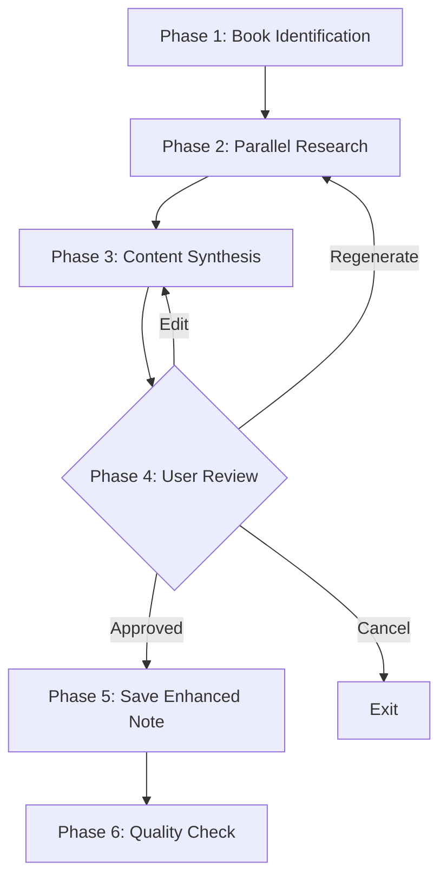
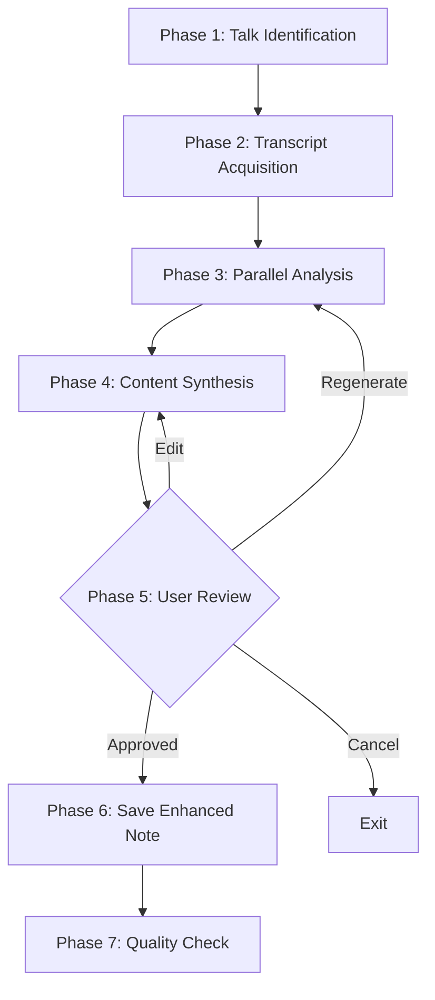
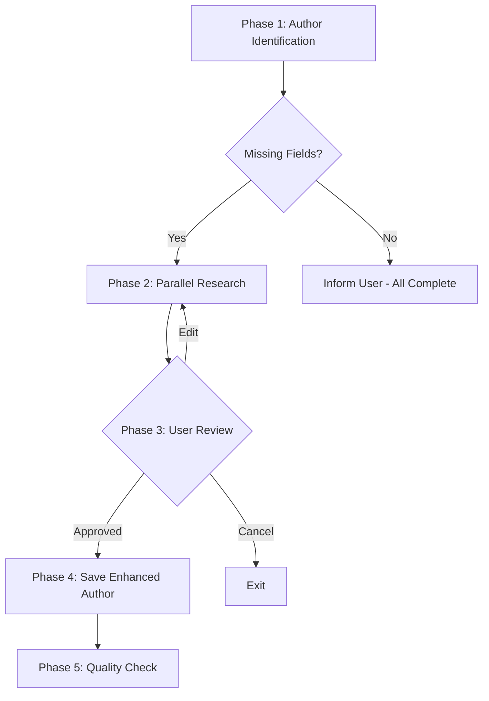

# Enhancing Content

Second Brain includes three Claude Code skills for enhancing existing content with rich summaries, timestamps, and metadata via AI-powered web research.

## Overview

| Skill | Trigger Commands | What It Does |
|-------|------------------|--------------|
| `/enhancing-notes` | "enhance notes", "improve book notes", "add key insights" | Adds Blinkist-style summaries to book notes |
| `/enhancing-talks` | "enhance talk", "add timestamps", "blinkist-style talk summary" | Adds timestamped insights to talk notes |
| `/enhancing-authors` | "enhance author", "complete author profile", "find author info" | Fills missing author profile fields |

## /enhancing-notes

Transforms basic book notes into Blinkist-style summaries with Key Insights, Notable Quotes, Core Message, and Who Should Read sections.

### Workflow



### Phase 1: Book Identification

The skill accepts a book slug, title, or partial name:

1. **Exact slug match**: Checks `content/{slug}.md` directly
2. **Title search**: Uses Grep to find matching titles
3. **Validation**: Confirms `type: book` in frontmatter

### Phase 2: Parallel Research

Four WebSearch agents run concurrently:

| Agent | Focus | Query Pattern |
|-------|-------|---------------|
| Agent 1 | Key insights | `'[Title]' key insights summary` |
| Agent 2 | Main ideas | `'[Title]' by [Author] main ideas book summary` |
| Agent 3 | Audience & takeaways | `'[Title]' book review who should read` |
| Agent 4 | Notable quotes | `'[Title]' [Author] best quotes site:goodreads.com` |

### Phase 3: Content Synthesis

Generated sections:

**Core Message** (1-2 sentences, under 50 words)
> Small daily improvements compound into remarkable results. Success is not about massive action but consistent 1% gains that accumulate over time.

**Key Insights** (8-12 numbered blinks)
```markdown
1. **The 1% Rule** - Improving by just 1% each day leads to being 37 times better after one year. This compound effect works because small gains build on each other.

2. **Systems Over Goals** - Goals are about the results you want; systems are about the processes that lead to results. Winners and losers often have the same goals—what differs is the systems they follow.
```

**Notable Quotes** (3 blockquotes)
```markdown
> "You do not rise to the level of your goals. You fall to the level of your systems."
```

**Who Should Read This** (1-2 paragraphs describing ideal reader)

### Phase 4: User Review (Blocking Gate)

The skill presents a preview and asks for approval:

- **Save**: Proceeds to save the enhanced note
- **Regenerate**: Runs research again with different focus
- **Edit**: Applies user feedback
- **Cancel**: Exits without changes

### Phase 5: Save Enhanced Note

New sections are inserted after the opening paragraph:

```markdown
---
(existing frontmatter unchanged)
---

(existing opening paragraph preserved)

## Core Message
[Generated content]

## Key Insights
[8-12 numbered insights]

## Notable Quotes
[3 blockquotes]

## Who Should Read This
[Audience description]

---

(original body content preserved below)
```

### Example Conversation

```
User: enhance notes for atomic habits

Claude: Let me find and enhance the notes for "Atomic Habits"...

        [Runs 4 parallel WebSearch agents]

        ## Preview of Enhanced Content

        ### Core Message
        Small daily improvements compound into remarkable results...

        ### Key Insights
        1. **The 1% Rule** - Improving by just 1% each day...
        [...]

        Does this enhancement look good?
        - Save
        - Regenerate
        - Edit
        - Cancel

User: Save

Claude: ✓ Enhanced: content/atomic-habits.md
          - Core Message: 28 words
          - Key Insights: 10 insights
          - Notable Quotes: 3 quotes
          - Who Should Read: added
          - Original content: preserved
```

---

## /enhancing-talks

Transforms basic talk notes into Blinkist-style summaries with **timestamped** insights, talk structure, and actionable takeaways.

### Workflow



### Key Difference from Book Enhancement

Talk enhancement uses **transcript analysis** instead of web research:

```bash
python3 .claude/skills/adding-notes/scripts/get-youtube-transcript.py '{url}' --format=json
```

Returns structured JSON with timestamps:
```json
{
  "segments": [
    {"start": 0.0, "timestamp": "0:00", "duration": 30.5, "text": "..."},
    {"start": 30.5, "timestamp": "0:30", "duration": 28.2, "text": "..."}
  ]
}
```

### Phase 3: Parallel Analysis

Four agents analyze the transcript:

| Agent | Focus | Output |
|-------|-------|--------|
| Agent 1 | Key insights | 8-12 insights with timestamps |
| Agent 2 | Talk structure | 4-7 sections with timestamps |
| Agent 3 | Notable quotes | 3 quotes with timestamps |
| Agent 4 | Audience & actions | Who should watch + action items |

### Generated Sections

**Core Message** (1-2 sentences)
> Local-first software must survive not just network outages, but the complete disappearance of its creators.

**Key Insights** (with timestamps)
```markdown
1. **CRDTs Are Necessary But Not Sufficient** (8:45) - Skiff, built on yjs CRDTs, still shut down when Notion acquired it. Technology alone doesn't guarantee resilience.

2. **Self-Hosting Isn't the Answer** (15:22) - Self-hosting requires technical skills most users lack, and even skilled users don't want to run servers.
```

**Talk Structure** (chapter-style overview)
```markdown
1. **Introduction** (0:00) - Sets up the problem of cloud dependency
2. **Historical Context** (4:30) - Traces local-first from CRDTs to today
3. **Case Studies** (12:00) - Examines Skiff and other failures
4. **The Solution** (25:00) - Proposes commoditized sync infrastructure
5. **Q&A** (40:00) - Addresses audience questions
```

**Notable Quotes** (with timestamps)
```markdown
> "You do not rise to the level of your goals. You fall to the level of your systems." (12:34)
```

**Who Should Watch** (1-2 paragraphs)

**Action Items** (3-5 checkbox items)
```markdown
- [ ] Audit your app's offline capabilities
- [ ] Evaluate CRDT libraries for your use case
- [ ] Test your app with network completely disabled
```

### Fallback Behavior

If transcript is unavailable:
1. Try alternative language with `--lang` flag
2. Fall back to WebSearch-based analysis (like `/enhancing-notes`)

---

## /enhancing-authors

Fills missing author profile fields (bio, avatar, website, socials) via web research.

### Workflow



### Phase 1: Author Identification

1. **Exact slug match**: Checks `content/authors/{slug}.md`
2. **Name search**: Uses Grep to find matching author names
3. **Field analysis**: Identifies which fields are missing

### Fields That Can Be Enhanced

| Field | Description | Example |
|-------|-------------|---------|
| `bio` | Professional background (1-2 sentences) | "Founder of X, creator of Y" |
| `avatar` | Profile picture URL | `https://github.com/username.png` |
| `website` | Personal website | `https://example.com` |
| `socials.twitter` | Twitter/X handle | `username` |
| `socials.github` | GitHub username | `username` |
| `socials.linkedin` | LinkedIn username | `username` |
| `socials.youtube` | YouTube channel | `channelname` |

### Phase 2: Parallel Research

Up to 3 agents run based on missing fields:

| Agent | Focus | Query Pattern |
|-------|-------|---------------|
| Agent 1 | Bio/background | `'[Name]' bio background expertise` |
| Agent 2 | Avatar URL | `'[Name]' site:github.com OR site:twitter.com` |
| Agent 3 | Website & socials | `'[Name]' twitter github linkedin youtube` |

::alert{type="info"}
Agents are only spawned for missing fields. If `bio` already exists, Agent 1 is skipped.
::

### Phase 3: User Review

Changes are presented as a comparison table:

```markdown
| Field | Current | Proposed |
|-------|---------|----------|
| bio | (empty) | "Founder of X, creator of Y..." |
| avatar | (empty) | "https://github.com/username.png" |
| website | (empty) | "https://example.com" |
| socials.twitter | (empty) | "username" |
| socials.github | (empty) | "username" |
| socials.linkedin | (empty) | "username" |
| socials.youtube | (empty) | (not found) |
```

### Example Conversation

```
User: enhance author james clear

Claude: Let me find and enhance the author profile for "James Clear"...

        Checking content/authors/james-clear.md...

        Missing fields detected:
        - bio
        - avatar
        - socials.twitter
        - socials.github

        [Runs parallel WebSearch agents]

        ## Proposed Updates for James Clear

        | Field | Current | Proposed |
        |-------|---------|----------|
        | bio | (empty) | "Author of Atomic Habits, speaker..." |
        | avatar | (empty) | "https://github.com/jamesclear.png" |
        | socials.twitter | (empty) | "JamesClear" |
        | socials.github | (empty) | (not found) |

        Save these changes to the author profile?
        - Save
        - Edit
        - Cancel

User: Save

Claude: Updated: content/authors/james-clear.md
          - bio: added
          - avatar: added
          - socials.twitter: added
```

---

## Quality Standards

All enhancement skills follow these standards:

### Writing Style

Referenced from `/writing-style` skill:
- **Active voice**: "The author argues..." not "It is argued..."
- **No boilerplate**: Jump straight to insights
- **Everyday words**: "use" not "utilize"
- **Specific details**: Include examples and data

### Preservation Rules

- Never delete existing content
- Keep all frontmatter fields
- Keep opening paragraphs
- Keep all wiki-links `[[slug]]`
- Separator `---` divides generated from original

### Quality Checks

All skills run before completion:
```bash
pnpm lint:fix && pnpm typecheck
```
