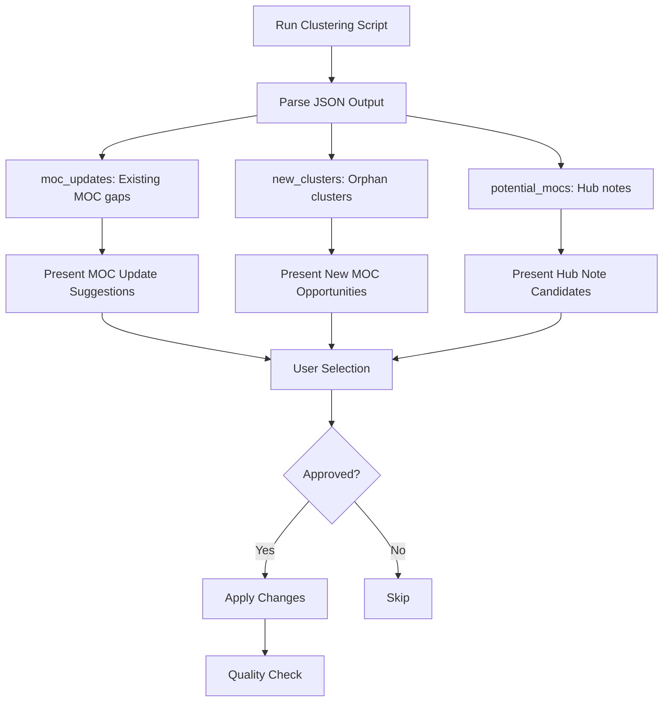

# Organizing Knowledge

Knowledge organization skills help you maintain a well-connected, structured knowledge base. These skills focus on discovering connections, curating MOCs (Maps of Content), managing tags, and analyzing the overall health of your knowledge graph.

## Skills Overview

| Skill | Purpose | Trigger Phrases |
|-------|---------|-----------------|
| `/linking-notes` | Discover wiki-link connections | "find connections", "link this note", "what should I link to" |
| `/moc-curator` | Suggest MOC updates and clusters | "curate MOCs", "update maps", "find clusters" |
| `/managing-tags` | Audit and consolidate tags | "clean up tags", "tag audit", "merge tags" |
| `/exploring-graph` | Analyze graph structure | "analyze connections", "graph report", "find orphans" |

---

## /linking-notes

Discovers meaningful connections between notes and suggests wiki-links to add.

### Philosophy

**Aim for connection, not perfection.** Every note benefits from 2-3 meaningful links. An orphan note is harder to discover than an over-connected one.

### When to Link

✅ **Link when:**
- Same author or creator
- Explicitly references or cites the other work
- Directly builds on or responds to the other content
- Covers the same core topic (e.g., two notes about "habit formation")
- Part of the same series or project
- Should be grouped together in a Map Note (MOC)
- Offers a contrasting perspective on the same idea
- Applies theory from one note to practice in another

❌ **Avoid linking when:**
- Only vague thematic overlap (e.g., "both mention AI")
- The connection requires multiple hops of reasoning
- You haven't read the target note and can't explain the relationship

::alert{type="warning"}
**Every link needs context.** Don't just link - explain WHY the connection exists in 1 sentence.
::

### Workflow


### Output Format

The skill presents suggestions in two tiers:

```markdown
## Suggested Wiki-Links for [Note Title]

### Strong Connections
- [[related-note-1]] - Same author, discusses related concepts
- [[related-note-2]] - Directly cited in this content

### Potential Connections (Review Needed)
- [[maybe-related]] - Shares "testing" tag, similar topic
```

### Example Conversation

```
User: What should I link to from my note on "atomic habits book"?

Claude: Let me analyze your note on Atomic Habits and find connections.

## Suggested Wiki-Links for "atomic-habits-book"

### Strong Connections
- [[james-clear]] - Author of this book
- [[habit-loop]] - Discusses the cue-routine-reward framework from this book
- [[tiny-habits]] - Related book on the same topic by BJ Fogg

### Potential Connections (Review Needed)
- [[compound-growth]] - Shares theme of 1% improvements
- [[behavior-change]] - General tag overlap on habits

Would you like me to add any of these links to your note?
```

---

## /moc-curator

Uses semantic embeddings to suggest MOC (Map of Content) updates and discover new MOC opportunities.

### Capabilities

1. **Find MOC Gaps**: Notes that should be in existing MOCs but aren't linked
2. **Discover Clusters**: Groups of orphan notes that could form new MOCs
3. **Detect Hub Notes**: Notes with many outgoing links that could become MOCs
4. **Per-Note Suggestions**: Which MOCs a specific note should join

### Workflow



### Script Modes

The skill uses a Python script with multiple analysis modes:

```bash
# Full analysis (MOC gaps + new clusters + hub notes)
python3 .claude/skills/moc-curator/scripts/cluster-notes.py --mode=full

# Only MOC gaps
python3 .claude/skills/moc-curator/scripts/cluster-notes.py --mode=moc-gaps

# Only orphan clusters
python3 .claude/skills/moc-curator/scripts/cluster-notes.py --mode=new-clusters

# Only hub notes (potential MOCs)
python3 .claude/skills/moc-curator/scripts/cluster-notes.py --mode=hub-notes

# Suggestions for a specific note
python3 .claude/skills/moc-curator/scripts/cluster-notes.py --mode=for-note --note=slug-name

# Adjust similarity threshold (default: 0.7 - strict)
python3 .claude/skills/moc-curator/scripts/cluster-notes.py --threshold=0.6
```

### Output Examples

**MOC Gap Suggestion:**
```markdown
### [[vue-patterns]] - Vue Development Patterns

Currently has 8 members. Suggested additions:

1. **[[vue-provide-inject]]** (score: 0.85)
   - Type: article | Tags: vue, patterns
   - Shares tags: vue, patterns
   - High semantic similarity to existing members

2. **[[nuxt-composables-guide]]** (score: 0.78)
   - Type: youtube | Tags: nuxt, vue
   - Referenced by 2 existing members
```

**New MOC Opportunity:**
```markdown
### Potential New MOC: "AI Agent Development"

Common tags: ai, agents, llm

Notes in this cluster:
- [[12-factor-agents]] - Principles for building AI agents
- [[context-efficient-backpressure]] - Managing LLM context windows
- [[tool-calling-patterns]] - How to structure agent tools

**Suggested MOC name**: `ai-agents-guide.md`
```

### Quality Guidelines

- Only suggest notes with similarity >= 0.7 (strict threshold)
- New MOCs require at least 3 notes in a cluster
- Always show the reasoning (shared tags, similarity score)
- User approval is required before any changes are made

---

## /managing-tags

Maintains tag hygiene by finding inconsistencies and consolidating similar tags.

### Workflow


### Issue Types

#### Similar Tags (Merge Candidates)
Tags that likely mean the same thing:
- `ai` vs `artificial-intelligence`
- `js` vs `javascript`
- `habit` vs `habits` (plural inconsistency)

#### Naming Violations
Tags that don't follow kebab-case convention:
- `camelCase` tags → should be `kebab-case`
- `Capitalized` tags → should be `lowercase`
- `under_score` tags → should be `hyphens`

#### Rarely Used Tags
- Tags appearing only once (may indicate typo)
- Tags used 2-3 times (consider consolidation)

### Tag Naming Convention

All tags should be:
- **Lowercase**: `vue` not `Vue`
- **Kebab-case**: `local-first` not `local_first`
- **Consistent plurality**: Pick singular or plural, stick to it
- **Meaningful**: Avoid overly generic tags like `stuff`

### Common Merge Patterns

| Variations | Preferred |
|------------|-----------|
| `ai`, `artificial-intelligence`, `AI` | `ai` |
| `js`, `javascript`, `JavaScript` | `javascript` |
| `vue`, `vuejs`, `vue-js` | `vue` |
| `dev`, `development` | `development` |
| `test`, `testing`, `tests` | `testing` |

### Example Report

```markdown
## Tag Audit Report

### Tag Inventory (by frequency)
| Tag | Count |
|-----|-------|
| vue | 12 |
| testing | 8 |
| ai | 5 |
| javascript | 4 |
| habits | 3 |

### Similar Tags (Merge Candidates)
- `ai` (5) + `artificial-intelligence` (1) → suggest: `ai`
- `habit` (2) + `habits` (3) → suggest: `habits`

### Naming Issues
- `JavaScript` in `js-frameworks.md` → should be `javascript`
- `local_first` in `offline-apps.md` → should be `local-first`

### Rarely Used (1 occurrence)
- `obscure-tag` - only in `random-note.md` (typo for `obscured`?)
```

---

## /exploring-graph

Analyzes the structure of connections in the knowledge base to surface insights.

### Metrics Calculated

| Metric | Description |
|--------|-------------|
| Outgoing links | Wiki-links in this note |
| Incoming links | Other notes linking to this one |
| Total connections | Outgoing + Incoming |

### Pattern Detection

#### Hub Notes
Notes with the highest total connections. These are central to your knowledge base and often indicate core concepts or key resources.

#### Orphan Notes

| Type | Description |
|------|-------------|
| Full orphans | 0 incoming AND 0 outgoing links |
| Dead ends | Has outgoing but 0 incoming |
| Sources | Has incoming but 0 outgoing |

#### Clusters
Groups of notes that link heavily to each other. Detected by:
- Shared tags
- Mutual links
- Map membership (notes linked from `type: map` notes)

#### Broken Links
Wiki-links pointing to non-existent notes.

### Graph Health Indicators

| Indicator | Healthy | Warning |
|-----------|---------|---------|
| Orphan rate | <10% | >20% |
| Avg connections | >2 | <1 |
| Broken links | 0 | Any |

### Example Report

```markdown
## Knowledge Graph Analysis

### Overview
- Total notes: 156
- Total connections: 423
- Average connections per note: 2.7
- Orphan rate: 8%

### Hub Notes (Top 5 Most Connected)
| Note | Outgoing | Incoming | Total |
|------|----------|----------|-------|
| [[zettelkasten-method]] | 8 | 15 | 23 |
| [[vue-patterns]] | 12 | 9 | 21 |
| [[atomic-habits-book]] | 6 | 11 | 17 |
| [[testing-philosophy]] | 9 | 7 | 16 |
| [[second-brain-concept]] | 5 | 10 | 15 |

### Orphan Notes (Need Attention)

**Full Orphans** (isolated):
- `random-thought.md` - no connections at all
- `old-draft.md` - never linked

**Dead Ends** (no incoming links):
- `new-article-today.md` - recently added
- `book-im-reading.md` - work in progress

### Connection Opportunities
Based on shared tags and titles:
- [[note-a]] and [[note-b]] share 3 tags but aren't linked
- [[concept-x]] mentions "habit formation" - link to [[atomic-habits-book]]?

### Broken Links Found
- `[[non-existent-note]]` in `some-file.md`
```

---

## Best Practices

### Regular Maintenance

1. **Weekly**: Run `/linking-notes` on newly added content
2. **Monthly**: Run `/moc-curator` to find gaps and clusters
3. **Quarterly**: Run `/managing-tags` for tag hygiene audit
4. **As needed**: Run `/exploring-graph` to check overall health

### Connection Quality Over Quantity

- A note with 3 meaningful connections is better than one with 10 weak ones
- Every link should have a clear reason that can be stated in one sentence
- When in doubt, create a MOC to group related notes rather than cross-linking everything

### MOC Strategy

- MOCs work best for learning paths, topic clusters, and curated collections
- Keep MOCs focused - if one grows beyond ~15-20 notes, consider splitting
- Use MOC membership to create visual clusters on the knowledge graph
