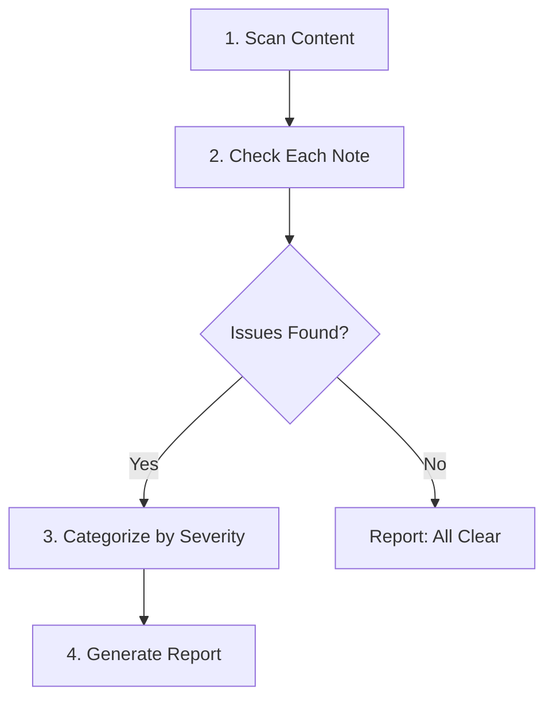
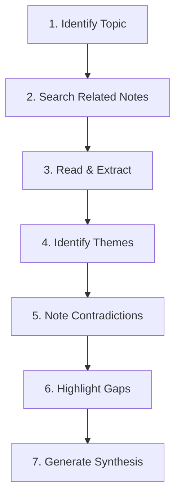

# Quality and Review Skills

This page documents the skills for maintaining high-quality notes and reviewing your knowledge base.

## Overview

Quality skills help you maintain a healthy knowledge base by auditing notes for issues, synthesizing knowledge across topics, and applying consistent writing standards.

| Skill | Trigger Phrases | Purpose |
|-------|-----------------|---------|
| `/reviewing-notes` | "review notes", "audit my knowledge base", "find broken links" | Audit notes for quality issues |
| `/summarizing-topic` | "what do I know about X", "summarize topic", "overview of" | Synthesize knowledge from multiple notes |
| `/writing-style` | Referenced by other skills | Guidelines for clear, economical prose |

---

## /reviewing-notes

Audits the knowledge base for quality issues and produces an actionable report.

### What It Checks

| Issue | Severity | Impact |
|-------|----------|--------|
| Broken wiki-links | Critical | Navigation fails |
| Missing summary | High | Poor discoverability |
| Orphan notes | High | Lost in graph |
| Insufficient tags (<2) | Medium | Harder to find |
| Short content (<100 words) | Medium | May be incomplete |
| Missing date field | Low | Timeline unclear |

### Workflow



### Issue Categories

**Missing or Weak Summaries:**
- No `summary:` field in frontmatter
- Summary is empty or very short (<10 words)
- Summary doesn't capture the core idea

**Broken Wiki-Links:**
- `[[slug]]` patterns where the target file doesn't exist
- Each broken link is a navigation dead-end for readers

**Orphan Notes:**
- No outgoing wiki-links (doesn't reference other notes)
- No incoming wiki-links (not referenced by other notes)
- Both = fully isolated node in the knowledge graph

**Insufficient Tags:**
- Notes with fewer than 2 tags
- Makes the note harder to discover via filtering

**Short Content:**
- Body content under 100 words
- May indicate an incomplete or stub note

**Missing Required Frontmatter:**
- No `title` field
- No `type` field
- Missing `date` field

### Example Report Output

```markdown
## Quality Audit Report

### Critical Issues
- **Broken Links**
  - `note-a.md`: links to [[non-existent]] (file not found)

### High Priority
- **Missing Summaries**
  - `note-b.md`: no summary field
  - `note-c.md`: summary is empty

- **Orphan Notes** (no connections)
  - `isolated-note.md`: 0 incoming, 0 outgoing links

### Medium Priority
- **Insufficient Tags** (<2 tags)
  - `note-d.md`: only 1 tag

- **Short Content** (<100 words)
  - `stub-note.md`: 45 words

### Low Priority
- **Missing Optional Fields**
  - `note-e.md`: no date field
```

### Example Usage

```
You: Review my notes for quality issues

Claude: I'll audit your knowledge base. Let me scan all content files...

[Scans 150 notes, checks wiki-links, tags, summaries]

## Quality Audit Report

### Critical Issues (fix immediately)
Found 2 broken wiki-links:
- `vue-reactivity.md`: links to [[vue-refs]] → should be [[vue-ref]]
- `testing-guide.md`: links to [[vitest-setup]] → file doesn't exist

### High Priority
3 notes missing summaries:
- `quick-note-on-pinia.md`
- `typescript-tips.md`
- `random-thoughts.md`

5 orphan notes with no connections:
- `old-draft.md`
- `imported-bookmark.md`
...

Would you like me to help fix any of these issues?
```

---

## /summarizing-topic

Synthesizes knowledge from multiple notes on a topic to create a unified understanding.

### When to Use

- "What do I know about [topic]?"
- Need to prepare for a conversation or meeting
- Want to identify gaps in your knowledge
- Looking for connections across sources

### Workflow



### Search Strategy

The skill searches for related notes using multiple approaches:

**By tag:**
```bash
# Find all notes tagged with the topic
grep -l "tags:.*vue" content/*.md
```

**By content:**
```bash
# Find notes mentioning the topic
grep -l "composable" content/*.md
```

**By wiki-links:**
```bash
# Find notes linking to topic-related content
grep -l "\[\[vue-reactivity\]\]" content/*.md
```

### Extraction Process

For each related note, the skill extracts:
- **Title and type**: What is this content?
- **Summary**: The core idea
- **Key points**: Main takeaways
- **Quotes**: Memorable passages
- **Connections**: What it links to

### Output Format

```markdown
## What You Know About [Topic]

### Overview
[1-2 paragraph synthesis based on your notes]

### Key Themes
1. **Theme A**: Explanation drawing from multiple notes
2. **Theme B**: Explanation drawing from multiple notes

### Sources in Your Knowledge Base
| Note | Type | Key Contribution |
|------|------|------------------|
| [[note-1]] | article | Introduces concept X |
| [[note-2]] | book | Deep dive on approach Y |
| [[note-3]] | podcast | Practical examples |

### Notable Quotes
> "Quote from note-1"
> "Quote from note-2"

### Gaps and Questions
- You don't have notes on [related subtopic]
- Consider exploring: [suggested areas]

### Suggested Next Steps
- Read [[related-note]] for more on X
- Consider adding notes on Y
```

### Output Formats

| Format | Use Case | Content |
|--------|----------|---------|
| Brief Summary | Quick reference | 2-3 paragraphs max |
| Comprehensive | Deep understanding | All sections above |
| Gap Analysis | Deciding what to read next | Focus on missing areas |

### Synthesis Guidelines

**Do:**
- Identify common threads across notes
- Note contradictions or different perspectives
- Highlight unique insights from each source
- Suggest gaps in coverage

**Don't:**
- Just list summaries without connecting them
- Ignore contradictions between sources
- Over-quote without synthesis
- Make up information not in the notes

### Example Usage

```
You: What do I know about testing Vue components?

Claude: Let me search your knowledge base for testing-related notes...

[Finds 8 related notes across articles, podcasts, and books]

## What You Know About Testing Vue Components

### Overview
Your notes cover testing from multiple angles: Kent C. Dodds' Testing
Trophy approach (from his course), Vue-specific testing patterns
(from several articles), and practical Vitest configuration (from
your own TILs).

### Key Themes

1. **Test Behavior, Not Implementation**
   Multiple sources emphasize testing what users see, not internal
   component state. Your note on [[testing-library-principles]]
   captures this as "the more your tests resemble the way your
   software is used, the more confidence they give you."

2. **The Testing Trophy**
   From [[kent-dodds-testing-course]]: integration tests give the
   best ROI. Unit tests for utilities, E2E for critical paths.

3. **Vue Test Utils vs Testing Library**
   Your notes show both approaches. [[vue-test-utils-guide]] covers
   shallow mounting and stubs; [[testing-library-vue]] advocates
   for user-centric queries.

### Sources in Your Knowledge Base
| Note | Type | Key Contribution |
|------|------|------------------|
| [[kent-dodds-testing-course]] | course | Testing Trophy philosophy |
| [[testing-library-principles]] | article | User-centric testing |
| [[vitest-setup-til]] | note | Practical configuration |

### Gaps and Questions
- No notes on component testing with MSW (mock service worker)
- Limited coverage of snapshot testing best practices
- No notes on testing composables in isolation

### Suggested Next Steps
- Consider adding notes on MSW for API mocking
- Your [[vitest-setup-til]] could link to [[testing-library-vue]]
```

---

## /writing-style

Guidelines for clear, economical prose. This skill is referenced by other skills when generating content.

### The 10 Rules

Based on "Economical Writing" by Deirdre N. McCloskey:

| Rule | Description | Example |
|------|-------------|---------|
| 1. Be Clear | Clarity is speed directed at the point | Give your reader every help possible |
| 2. Use Active Verbs | Verbs make English | "Use active verbs" not "Active verbs should be used" |
| 3. Avoid Boilerplate | Cut throat-clearing | Never start with "This note will explore..." |
| 4. One Point Per Paragraph | Complete discussion of one topic | Don't scatter or cram ideas |
| 5. Make Writing Cohere | Logical flow throughout | Use transitions so readers follow easily |
| 6. Avoid Elegant Variation | Consistency over sophistication | Say "book" every time, not "tome", "volume", "work" |
| 7. Watch Punctuation | Colon = "to be specific", Semicolon = "likewise" | Commas after introductory phrases |
| 8. End with the Point | End of sentence is emphatic | Rearrange so main point lands last |
| 9. Replace Vague Pronouns | Name things explicitly | Avoid unclear "this", "that", "these" |
| 10. Write How You Speak | Use everyday words | "use" not "utilize", "start" not "commence" |

### Quick Checklist

When reviewing generated content:

- [ ] No filler phrases ("In this note, we will...")
- [ ] Active voice throughout
- [ ] Each paragraph has one clear point
- [ ] Sentences end with emphasis
- [ ] No vague "this/that" pronouns without clear referents
- [ ] Everyday words over jargon
- [ ] Consistent terminology (no elegant variation)

### Alexander Opalic's Voice Profile

The skill includes voice profile analysis from 22+ blog posts, used when drafting blog content.

**Opening Patterns:**
- Start with a problem or personal observation, not a definition
- Hook with a relatable developer pain point
- Use first-person to establish context

**Signature Phrases:**

| Type | Examples |
|------|----------|
| Opening hooks | "Here's the thing:", "I once worked on a project that...", "[Task] gets old fast." |
| Transitions | "Let me show you how...", "The key insight is...", "In my experience..." |
| Honest acknowledgments | "I learned this the hard way", "far from perfect", "adds complexity" |

**Visual Communication:**
- Mermaid diagrams for processes/architecture
- ❌/✅ markers for anti-patterns vs. best practices
- 💡 for tips, ⚠️ for warnings
- Comparison tables for trade-off analysis

**Section Templates:**
- "The Problem" → "The Solution" → "Implementation" → "Gotchas"
- "When to use X" / "When NOT to use X"
- "Best Practices" with numbered guidelines

### Tone Guidelines

- Be honest about limitations and trade-offs
- Acknowledge alternative approaches exist
- Use everyday words - "use" not "utilize"
- End with actionable next steps
- Never be prescriptive without acknowledging alternatives

---

## Best Practices

### Regular Quality Audits

Run `/reviewing-notes` periodically (weekly or monthly) to catch issues early:
- Fix broken links immediately (critical)
- Add summaries to notes as you review them
- Connect orphan notes or archive them

### Topic Synthesis for Learning

Use `/summarizing-topic` to:
- Prepare for technical discussions
- Identify gaps before deep-diving on a topic
- Create Maps of Content (MOCs) from synthesis output

### Writing Consistency

The `/writing-style` skill helps maintain quality across all generated content:
- Referenced automatically by enhancement skills
- Use the checklist when reviewing AI-generated content
- Adapt voice profile for personal blog posts

### Quality Metrics

Track these indicators over time:

| Metric | Healthy | Concerning |
|--------|---------|------------|
| Broken links | 0 | Any |
| Notes with summaries | >90% | <70% |
| Average tags per note | ≥2 | <1.5 |
| Orphan rate | <10% | >20% |
| Average connections | >2 | <1 |
