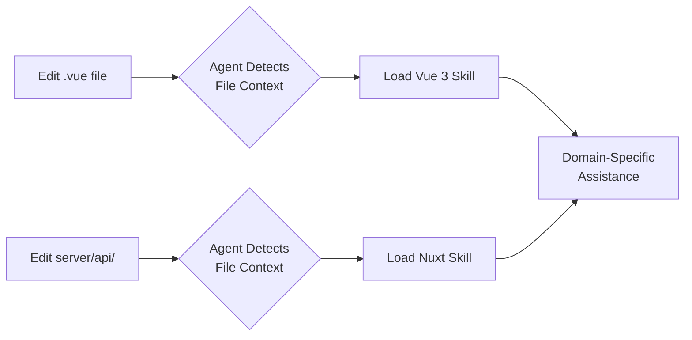

## Overview

Nuxt Skills packages ecosystem knowledge into portable skill files that AI coding assistants load automatically. Instead of teaching Claude or Copilot about Nuxt patterns through prompts, you install a skill set once and get domain-specific help whenever you're editing relevant files.

The project follows the Agent Skills open standard, making these skills work across Claude Code, GitHub Copilot, VS Code, and CLI agents.

## Key Features

- **10 specialized skills**: Vue 3, Nuxt 4+, Nuxt Modules, NuxtHub, Nuxt Content v3, Nuxt UI v4, Nuxt Better Auth, Reka UI, Document Writer, TypeScript Library
- **Context-aware activation**: Skills load based on file patterns (`.vue` files trigger Vue skill, `server/api/` triggers Nuxt skill)
- **Automated maintenance**: GitHub Actions regenerate component docs weekly and analyze changelogs biweekly
- **Multi-agent support**: Works with Claude Code, GitHub Copilot, VS Code agents, OpenCode, and Codex

## Code Snippets

### Installation

```bash
# Recommended: add-skill CLI
npx add-skill onmax/nuxt-skills

# Claude Code Marketplace
/plugin install nuxt-skills@nuxt-skills

# Manual: copy to skills directory
git clone https://github.com/onmax/nuxt-skills
cp -r nuxt-skills/skills/* ~/.claude/skills/
```

### Skill Activation Flow



## Technical Details

Built on the Agent Skills open standard format. Each skill contains:
- `skill.md` with frontmatter defining triggers and workflow
- Optional helper scripts and templates
- Documentation regenerated via automated workflows

The project demonstrates how ecosystem knowledge can be packaged for AI assistants rather than scattered across prompts and custom instructions.

## Connections

- [[claude-code-skills]] - Official documentation on the skills format this project implements
- [[introducing-agent-skills-in-vs-code]] - Covers the Agent Skills open standard that nuxt-skills follows
- [[claude-code-2-1-skills-universal-extension]] - Explains why skills became the default extension mechanism for Claude Code
